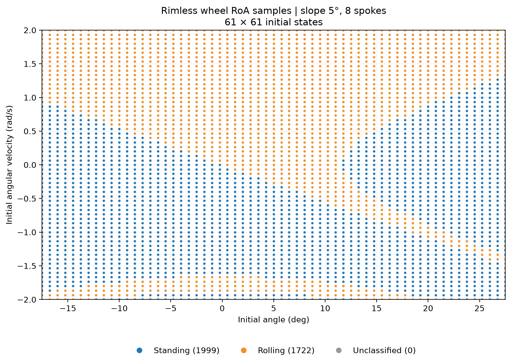
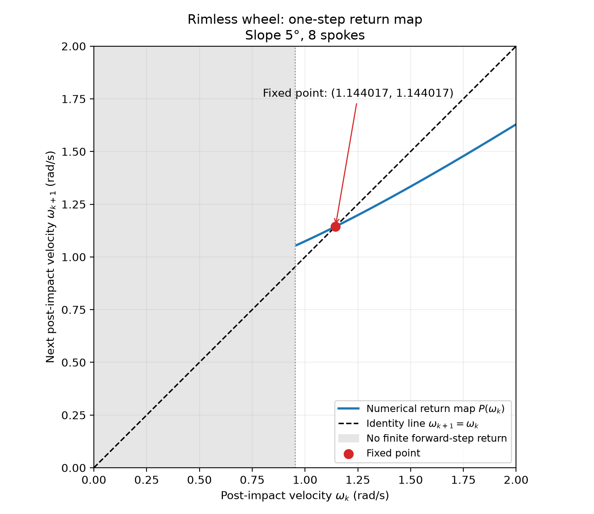
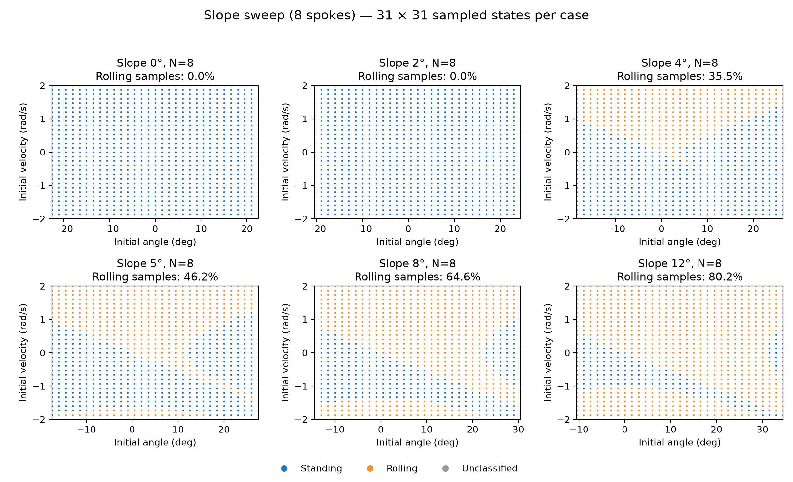
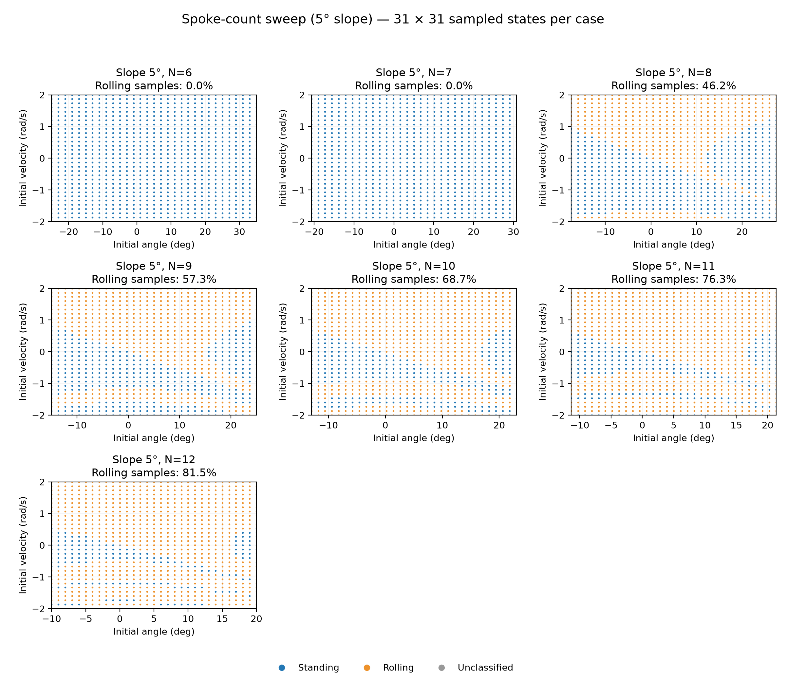
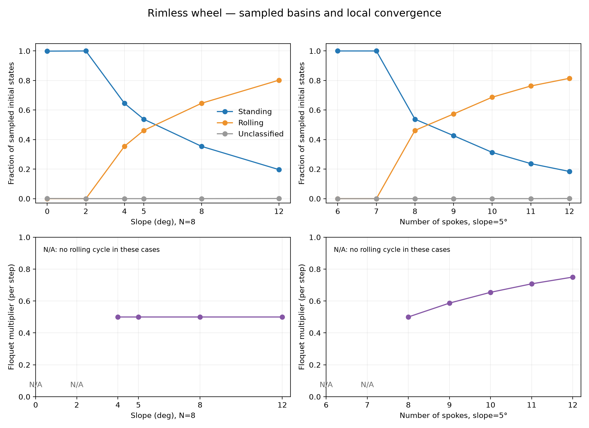

# Assignment 1 — Rimless Wheel

Author: dh787

## Sanity checks

Before estimating the regions of attraction, I tested two initial conditions to check whether the model produced physically reasonable behavior. Both tests used $g=9.81\ \mathrm{m/s^2}$, $l=1.0\ \mathrm{m}$, $m=0.2\ \mathrm{kg}$, $N=8$, and $\gamma=5^\circ$. Thus, $\alpha=22.5^\circ$, and the contact boundaries were $\theta=\gamma\pm\alpha=-17.5^\circ,\ 27.5^\circ$. The observations below refer to the event-driven simulation, which locates contact before applying the impact reset.

### 1. Sustained downhill rolling

The initial state was

$$
[\theta_0,\omega_0]=[-17.5^\circ,\ 2.0\ \mathrm{rad/s}].
$$

**Expected:** The initial angular velocity should be sufficient to carry the wheel past the upright position. I expected repeated downhill steps, with energy lost at each impact and supplied by descending the slope. The post-impact angular velocity should approach a repeatable value.

**Observed:** The simulation produced 23 impacts over 20 seconds. The post-impact angular velocity approached approximately $1.144\ \mathrm{rad/s}$, and the final six post-impact velocities satisfied the rolling convergence criterion. This was consistent with the expected periodic rolling behavior. The angular velocity varied during each step; it was the post-impact values that became approximately constant.

### 2. Rocking followed by rest

The initial state was

$$
[\theta_0,\omega_0]=[-10^\circ,\ 0].
$$

**Expected:** Gravity should initially rotate the wheel in the negative angular direction. I expected it to rock between adjacent contact points, losing energy through successive impacts, and eventually approach a two-spoke standing configuration.

**Observed:** The simulation reached the standing criterion after 20 impacts. The final six post-impact angular velocities were approximately

$$
[-0.004315,\ 0.003051,\ -0.002157,\ 0.001525,\ -0.001079,\ 0.000763]\ \mathrm{rad/s}.
$$

The alternating signs indicated rocking, while the decreasing magnitudes indicated energy dissipation. The final speed fell below the $10^{-3}\ \mathrm{rad/s}$ stopping tolerance, and the remaining energy was insufficient to pass upright. The model therefore classified the state as approximately standing, rather than claiming that the exact impact velocity had become zero.

These tests supported the expected continuous-motion, impact-reset, and long-term behavior of the model for the selected initial conditions.

## Regions of attraction



For $\gamma=5^\circ$ and $N=8$, the figure shows a brute-force RoA estimate on a $61\times61$ grid of initial states. The horizontal axis is the initial angle $\theta_0$, and the vertical axis is the initial angular velocity $\omega_0$. Blue points converge to the standing equilibrium (two-spoke contact), while orange points converge to the stable rolling limit cycle. Each point represents one simulated initial condition; the sampled grid contains 1,999 standing cases, 1,722 rolling cases, and no unclassified cases.

## One-dimensional return map



The downhill contact event defines the Poincaré section, with angular velocity sampled immediately after each impact. The figure plots the next post-impact angular velocity $\omega_{k+1}=P(\omega_k)$ against the current post-impact angular velocity $\omega_k$, together with the identity line $\omega_{k+1}=\omega_k$. Their marked intersection gives the fixed point $\omega^*\approx1.144016620\ \mathrm{rad/s}$. At this point, the post-impact state repeats every step, corresponding to the rolling limit cycle rather than a stationary wheel.

## Effects of slope and number of spokes

### Sweep setup and local convergence measure

I first varied the slope over $0^\circ,2^\circ,4^\circ,5^\circ,8^\circ,12^\circ$ with $N=8$, then varied the number of spokes from 6 through 12 with $\gamma=5^\circ$. Gravity, spoke length, and mass remained unchanged. Each case used a $31\times31$ grid over $\theta_0\in[\gamma-\alpha,\gamma+\alpha]$ and $\omega_0\in[-2,2]\ \mathrm{rad/s}$. Simulations used adaptive integration with contact-event localization. Unclassified states at 20 s were retried at 40 s and then 80 s.

For each existing rolling cycle, I found its return-map fixed point and perturbed the post-impact angular velocity on both sides, keeping the post-impact angle fixed. The Floquet multiplier was estimated using

```math
\lambda \approx \frac{P(\omega^{\ast}+\varepsilon)-P(\omega^{\ast}-\varepsilon)}{2\varepsilon},
\qquad \varepsilon=10^{-4}\,\mathrm{rad/s}.
```

Locally, a small speed error satisfies $\delta\omega_{k+1}\approx\lambda\,\delta\omega_k$. Thus, $|\lambda|<1$ indicates local stability, and a smaller magnitude means faster error decay per step. N/A indicates that no sustainable rolling cycle exists for that parameter set; it does not mean that the multiplier is zero.

### Effect of slope



With eight spokes, no sustainable rolling cycle was found at $0^\circ$ or $2^\circ$. From $4^\circ$ to $12^\circ$, the fraction of sampled states converging to rolling increased from 35.48% to 80.23%, while the standing fraction decreased. A steeper slope supplies more gravitational energy per downhill step, making sustained rolling possible from more initial states. The steady post-impact speed also increased, from approximately 1.023 to 1.767 rad/s over these cases.

However, the Floquet multiplier remained approximately 0.5 wherever the rolling cycle existed. Near the cycle, the post-impact speed error therefore decreased by approximately one half per step. Increasing slope expanded the sampled rolling basin but did not improve this local per-step contraction rate.

### Effect of the number of spokes



At a $5^\circ$ slope, six and seven spokes did not sustain a rolling cycle. For eight through twelve spokes, the rolling sample fraction increased from 46.20% to 81.48%. More spokes reduce the angle between adjacent spokes, so the impact reset retains a larger fraction of angular velocity and kinetic energy. This makes sustained rolling accessible from more of the sampled initial conditions.

In contrast, local convergence became slower per step: the multiplier increased from approximately 0.5 at $N=8$ to 0.75 at $N=12$. Both cycles are locally stable, but a small speed error retains approximately 50% of its magnitude after one step in the former case and 75% in the latter. A larger rolling basin therefore does not necessarily mean faster local convergence. These comparisons are per step, not per second, since step duration also changes.

### Summary



The numerical multipliers agree with the ideal model's local result, $\lambda=\cos^2(2\alpha)=\cos^2(2\pi/N)$, wherever a rolling cycle exists. This explains why the multiplier is independent of slope in the tested rolling cases but increases with the number of spokes.

The plotted fractions describe only the sampled state range, not global basin probabilities. Each case samples the same normalized angle interval $(\theta_0-\gamma)/\alpha\in[-1,1]$ and velocity interval; the physical angle interval changes with the parameters. The few unclassified samples are exactly upright, stationary states, which are unstable equilibria rather than a third stable attractor. The sweep uses a coarser grid than the earlier $61\times61$ RoA plot, so its sample counts and fractions need not match that plot exactly.
